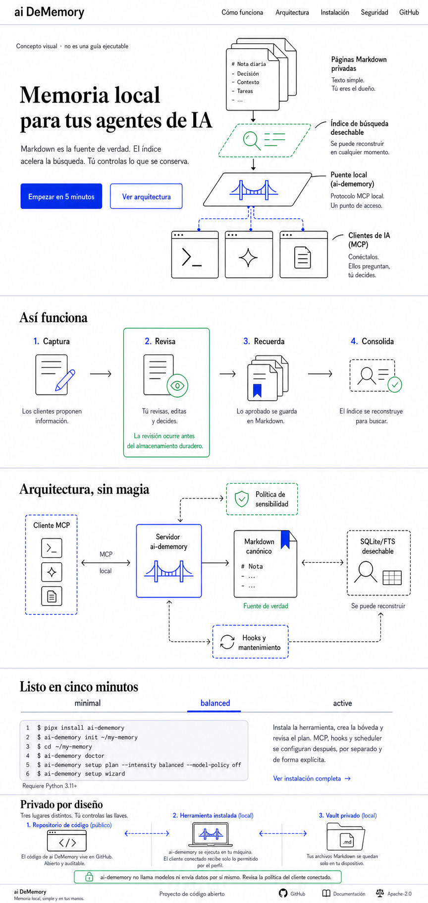

# Documentation Site Design Concepts

These files are non-production visual references for the documentation site
planned in `docs/documentation-site-plan.md`.

The desktop concept was generated from public product architecture and contains
no credentials, private keys, personal memories, private-vault content, or other
personal information. Its embedded provenance identifies it as OpenAI-generated;
it contains no user or vault provenance. It is intentionally stored outside
`site/` so it cannot be mistaken for a shipped page asset.

The image establishes composition, hierarchy, line-art language, and the
white/ink/cobalt/mint palette. It is not a source of product truth. Commands,
versions, labels, accessibility text, and technical arrows must be implemented
as reviewed HTML/SVG and verified against the source map in the plan.
