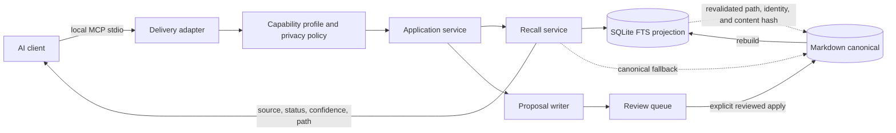

# Documentation Experience And Static Site Plan

Status: D0-D2 implementation and validation complete; D3 deployment remains
separately gated

Owner: Codex operational owner

Updated: 2026-08-03

Product foundation: PR #10 merged into canonical `main` at
`2e900acc021411193c5298addfece4c82fda69b4`. Documentation-plan baseline: PR
#12 merged at `c284dc9136abe933dc2635e2d5bb59dce9811a2e`.

## Decision

Build a small, progressive static documentation site for ai DeMemory. The first
screen should explain the product in under a minute, the next layer should get a
new user to a healthy local vault in about five minutes, and the technical layer
should expose the real architecture and trust boundaries without hiding behind
marketing language.

Use semantic HTML, CSS, and code-native SVG. JavaScript is optional enhancement,
not a rendering dependency. Do not introduce Node into the package, installed
runtime, or documentation build. The site is a documentation surface, not the
future product dashboard described by the visual-strangler roadmap.

Host the finished static artifact on GitHub Pages only after the content PR is
merged and a separate, security-reviewed deployment change is approved. The
Pages workflow changes a repository security boundary and must not be smuggled
into a content-only PR.

## Current Gaps

The repository documentation is technically strong but difficult to enter:

- `README.md` mixes first-run guidance, operator detail, MCP inventory, release
  evidence, and contributor workflows in one very long page.
- The first useful mental model is prose. There is no visual explanation of the
  proposal/review/canonical/index cycle.
- The `docs/` directory is a flat expert library with no audience or task-based
  route.
- Architecture and safety invariants exist, but readers must reconcile several
  documents to understand the complete data flow and the separation between
  public source, installed tool, and private vault.
- Resource intensities are documented as a table, but their practical tradeoffs
  are not explained visually.
- There is no dedicated web source, responsive design contract, accessibility
  gate, asset budget, or GitHub Pages deployment path.
- Product/version facts are repeated manually. A rich site could make that drift
  worse unless every claim has one named source.

The remedy is progressive disclosure and better information architecture, not
more prose on the existing README.

## Outcomes And Non-Goals

The site must let a reader answer these questions in order:

1. What problem does ai DeMemory solve?
2. Where does my private information live?
3. What is automatic, and what still requires review?
4. How do I install it safely?
5. How does a client request and receive memory?
6. What consumes CPU, memory, tokens, and background process time?
7. Where are the exact command, contract, and security references?

Non-goals for the first site:

- no dashboard, account system, telemetry, hosted memory, remote API, or
  browser-side vault access;
- no client-side search index, analytics, cookies, external fonts, or CDN
  JavaScript;
- no automatic translation, generated product claims, or screenshots used as
  normative instructions;
- no duplication of the complete CLI/MCP reference;
- no Node dependency merely to render static documentation.

## Audience Routes

| Reader | First route | Successful outcome |
| --- | --- | --- |
| Curious user | 60-second overview | Understands local-first memory and review before durable storage. |
| New installer | Five-minute setup | Creates a separate private vault and reaches a healthy `doctor` result. |
| Agent user | Client connection | Knows MCP is local, profile-limited, and bound to an explicit vault. |
| Privacy reviewer | Safety and boundaries | Can trace data, writes, generated indexes, and opt-in automation. |
| Maintainer | Technical architecture | Finds contracts, ADRs, tests, release status, and rollback rules. |

## Information Architecture

### Home: understand first

1. **Hero:** one sentence, one simple layer illustration, and two actions:
   start safely or inspect architecture.
2. **How it works:** Capture -> Review -> Remember -> Consolidate. Make the
   review gate visually unavoidable.
3. **Three separate places:** public source repository, installed executable,
   and private vault. Never show them as one folder or one sync target.
4. **Five-minute stable setup:** exact 2.0.0 PyPI, vault, health, setup-plan,
   and MCP commands with no hidden side effects.
5. **Unreleased 2.1 onboarding:** put the source install before its wizard,
   then explain `minimal`, `balanced`, and `active` as bounded operating
   envelopes. State separately that model policy does not let ai DeMemory call
   a model or embeddings.
6. **Privacy and autonomy:** proposal-only agent writes, explicit integration
   installation, generated indexes, and bounded process lifetime.
7. **Technical doorway:** link to the full flow, contracts, and current status.

### Guides: complete one job

- Install and create a private vault.
- Complete the stable 2.0.0 setup-plan/client path, or deliberately install the
  2.1.0 source line before running its preview-first wizard.
- Connect Codex, Claude, or another MCP client.
- Search, inspect evidence, and assemble bounded context.
- Review a proposal and apply an explicit decision.
- Enable hooks or scheduling as separate opt-in operations.
- Diagnose health, resource use, and process cleanup.
- Upgrade, rebuild projections, export, and recover.

### Technical: prove how it works

- System context and trust boundaries.
- Read flow, proposal/write flow, and maintenance flow.
- Canonical Markdown schema and disposable projections.
- MCP transport, capability profiles, and local REST boundary.
- Sensitivity policy, secret scanning, and public-only ceiling.
- Resource intensities and host-model policy as independent controls.
- Process ownership, leases, deadlines, EOF behavior, and tree reaping.
- Compatibility, migration, rollback, test evidence, ADR index, and release
  status.

The complete command inventory and long operational runbooks remain in the
existing Markdown docs. The site links to them instead of copying them.

## Required Explanatory Visuals

All production diagrams are semantic HTML plus inline SVG, with real text,
keyboard-readable links, a `<title>`/description, and an adjacent text fallback.
No essential instruction may exist only in a raster image.

1. **Local memory layers:** private Markdown pages, rebuildable index, local
   ai-dememory bridge, and multiple clients.
2. **Reviewed memory lifecycle:** capture -> proposal -> review -> canonical
   Markdown -> reindex -> recall. The rejected/edited branch remains visible.
3. **Three-place separation:** public repository != installed executable !=
   private vault.
4. **Technical request flow:** delivery adapter -> policy -> application service
   -> canonical/read projection -> provenance-bearing response.
5. **Resource envelopes:** compare ceilings and cadence without suggesting fake
   precision or model calls.
6. **Process lifecycle:** client start -> stdio lease -> bounded child work ->
   EOF/idle/deadline -> whole process tree exits.

The current desktop concept is stored at
`docs/design-concepts/documentation-site-desktop.png`. It is visual direction,
not product evidence. Its text must not be copied into the site without checking
the named source documents. Production diagrams will be recreated in HTML/SVG.

## Canonical Technical Flow



Interpretation:

- MCP and the optional loopback API are delivery adapters, not authorities.
- Profile and sensitivity checks execute before data is exposed or mutated.
- Search may use SQLite FTS, but every result is tied back to revalidated
  canonical Markdown. The index is disposable.
- Agent-facing writes create reviewable proposals. Durable Markdown changes
  require an explicit reviewed operation.
- Every memory-bearing recall response should preserve provenance sufficient for
  a human to inspect the source.

## Content Source Map

| Site claim | Authoritative source |
| --- | --- |
| Runtime and Python/Node boundary | `pyproject.toml`, `docs/adr/0254-python-node-runtime-boundary.md` |
| Canonical data and projections | `docs/architecture.md`, `docs/schema.md` |
| Installation commands | `docs/install.md`, packaged CLI smoke tests |
| Intensity and model policy | `docs/adr/0257-bounded-autonomy-and-resource-profiles.md`, policy code/tests |
| MCP profiles and tool exposure | generated MCP catalog, `docs/mcp-tool-profiles.md` |
| Hook behavior | `docs/hooks.md`, hook tests |
| Scheduling and process lifecycle | `docs/scheduler.md`, `docs/operations.md`, lifecycle tests |
| Security boundaries | `AGENTS.md`, `docs/architecture.md`, `docs/operations.md` |
| Current release and capability status | `README.md`, `docs/install.md`, exact release/tag evidence and package index verification, never stale prose alone |

Every implemented section receives a small source note in code comments or page
metadata. CI should fail when a source path disappears. Version numbers should
be injected from one checked-in product metadata source or omitted from evergreen
copy.

## Static Implementation Shape

```text
site/
  index.html
  install/index.html
  architecture/index.html
  security/index.html
  assets/
    site.css
    site.js                 # optional, enhancement only
    diagrams/*.svg
    illustrations/*.webp
  .nojekyll
scripts/
  docs_site_guard.py        # stdlib-only structural and source-map checks
tests/
  test_docs_site.py
```

Implementation rules:

- system font stack; no font downloads;
- responsive from 320 px to wide desktop with no horizontal overflow;
- normal document flow; no scroll-jacking, canvas-only diagrams, or hover-only
  meaning;
- working navigation and content without JavaScript;
- one optional script for small enhancements such as copying commands or
  persisting a user-selected tab, with no network access;
- relative URLs so the site works under `/ai-dememory/` and from a local static
  server;
- no secrets, private fixture data, runtime API calls, or embedded GitHub token;
- downloadable/raster assets are decorative or conceptual only; exact flows are
  SVG/HTML.

This choice keeps Node out of the installed and build runtime. If the site later
needs component reuse at a scale that plain HTML cannot sustain, evaluate a
build-only static generator in a new ADR. A framework must earn its dependency,
lockfile, supply-chain, and maintenance cost.

## Accessibility, Security, And Performance Gates

The content PR is not ready until it satisfies:

- WCAG 2.2 AA target: landmarks, heading order, focus visibility, keyboard
  navigation, contrast, reduced-motion support, and descriptive link text;
- text fallback for every diagram and useful `alt` text for every informative
  raster asset;
- desktop and mobile rendered checks at 320, 375, 768, and 1440 px;
- no overflow, overlap, clipped focus ring, hover-only control, or unreadable
  light/dark forced-color state;
- no external requests during a local smoke test;
- no production JavaScript dependency; optional JavaScript <= 8 KiB minified;
- first-page production assets <= 250 KiB compressed, excluding explicitly
  linked design-source concepts;
- individual production raster images <= 120 KiB, with responsive dimensions;
- all internal anchors, local files, source-map references, and copyable commands
  checked in CI;
- secret scan, `git diff --check`, docs guard, focal tests, and the existing full
  project suite green.

Use a preprovisioned Playwright or browser harness for rendered interaction and
responsive checks. This is validation tooling, not a normal documentation-build
dependency. Keep the structural/source-map guard dependency-free in Python so
normal repository validation does not require Node.

## D1/D2 Implementation Evidence

Local validation was established on 2026-08-01 and refreshed on 2026-08-03
after integration with canonical `main`. Temporary browser screenshots and
browser snapshots were inspected, then removed rather than committed as
generated evidence:

- the dependency-free guard passed structure, local link/anchor, stable/source
  command separation, source-derived resource profiles, reporting-policy
  status, external-resource, and asset-budget checks;
- the focused documentation suite passed eleven tests, including deliberate
  stable/source drift, profile drift, broken-link, remote-script,
  remote-`srcset`, SVG `href`, inline-CSS resource, and clipboard-fallback
  failures;
- repository validation, secret scan, ADR guard, and the complete 605-test
  suite passed with 51 host-specific skips;
- home, install, architecture, security, and 404 routes rendered at 320, 375,
  and 1440 px without page-level horizontal overflow;
- navigation, successful command copying, the semantic skip-link destination,
  and internal route transitions were verified with no console warning/error
  and no external request;
- sampled text/action contrast ratios ranged from 5.96:1 to 17.93:1.

Visual fidelity was checked against the accepted concept rather than guessed
from the source markup:

| Concept property | Implemented result |
| --- | --- |
| Editorial white canvas and dark serif hierarchy | Preserved with system serif/sans stacks and no font request. |
| Blue action and connector language | Preserved in calls to action, indexes, and read paths. |
| Green review/safety language | Preserved, with borders and labels so color is not the only signal. |
| Open horizontal bands instead of card grids | Preserved across overview, lifecycle, separation, and setup. |
| Layered local architecture illustration | Rebuilt as accessible inline SVG plus an adjacent text explanation. |
| Compact mobile reading order | Reflowed vertically; navigation wraps and long code scrolls internally. |

The browser evidence is a validation record, not a deployment claim. It was
refreshed after the `main` integration and must be rerun after any further
factual change and against the deployed origin before D3 exits.

## GitHub Pages Rollout

Split publication into two changes:

### PR A: content and static artifact

- Add the semantic site, diagrams, styles, tests, and documentation links.
- Run locally from `site/` with a static server.
- Review mobile/desktop rendering and network requests.
- Do not add deployment permissions.

### PR B: deployment boundary

- Add one dedicated Pages workflow only after PR A is merged.
- Pin every GitHub Action to a full commit SHA.
- Use only `contents: read`, `pages: write`, and `id-token: write` where the
  official Pages deployment requires them.
- Upload only `site/`; do not build or package the private vault or repository
  reports.
- Bind deployment to the `github-pages` environment and canonical `main`.
- Set Pages source to GitHub Actions, verify the public URL, inspect the deployed
  artifact, and record rollback steps.
- Resolve 404 assets and routes against the verified project Pages base path;
  document-relative links are intentionally only a local/content placeholder
  because nested missing URLs otherwise resolve below the missing path.

PR B touches `.github/workflows/` and therefore requires a fresh security review,
formal GitHub approval from an authorized identity, explicit owner authorization,
and post-merge readback. Never weaken branch protection to publish it.

Rollback has two explicit modes. For a bad release, keep Pages enabled and
redeploy the last known-good static commit. To withdraw the site entirely,
disable Pages and its deployment environment; do not claim that a disabled
environment can redeploy an artifact. Either operation must leave package
installation, MCP, the local API, and private vaults unaffected.

## Delivery Plan

### D0 - Information architecture and concept (implemented)

- Check in this plan and the non-production desktop concept.
- Link the plan from the README and modernization roadmap.
- Agree on page hierarchy, source map, and factual boundaries.

Exit: no orphan plan, no private information, and no deployment mutation.

### D1 - Accessible static prototype (implemented and locally validated)

- Implement the home page and the first three code-native diagrams.
- Add installation and architecture pages using the existing docs as sources.
- Keep JavaScript optional and add the dependency-free guard.

Exit: useful at 320 px and 1440 px, keyboard-complete, zero external requests,
and all commands/source links verified.

### D2 - Technical depth and validation (content validated; policy/origin gates remain)

- Security, resource-envelope, and process-lifecycle flows now exist in the
  static source.
- The security page states the implemented model and the current reporting-policy
  gap. A repository-level `SECURITY.md` still requires an exact preview and
  explicit owner approval before the site can claim a complete reporting path.
- Source mapping, page metadata, structural guards, asset budgets, and a 404
  page now exist. A canonical sitemap and public social-preview URL remain
  deferred until the Pages origin is live and verified.
- Browser, accessibility, responsive, link, secret, asset-budget, and full-suite
  evidence was collected from the content-identical working tree. It must be
  refreshed after any rebase or factual change.

Exit: a fresh reviewer can trace every material claim to source and reproduce
the rendered checks.

### D3 - GitHub Pages deployment

- Land the separate pinned workflow and repository Pages configuration.
- Verify the deployed artifact from a clean browser and mobile viewport.
- Add the public documentation URL to package metadata only after it is live.

Exit: exact `main` commit deployed, URL read back, rollback tested, no package or
vault coupling.

### D4 - Learn and improve

- Observe issues and support questions without adding analytics by default.
- Promote repeated confusion into clearer diagrams, task routes, or examples.
- Add Spanish pages only after the English source content is stable and a parity
  check prevents translation drift. The current Spanish concept is design input,
  not the language contract.

Exit: documentation changes are driven by verified reader friction, not surface
growth for its own sake.

## Continuous Improvement Cadence

Per product change:

- update the source map and affected task page;
- regenerate any contract-derived inventory;
- run structural and rendered documentation checks;
- remove stale screenshots or examples rather than preserving contradictory
  instructions.

Monthly while active:

- review broken links, repeated support questions, command drift, asset budgets,
  accessibility regressions, and mobile screenshots;
- sample the five-minute setup from a clean installed artifact on Windows,
  Linux, and macOS;
- verify that the public site still contains no private vault content or secret-
  like material.

Before each release:

- verify install commands and current support statements from the exact artifact;
- render critical pages at mobile and desktop sizes;
- check that the deployed documentation commit and package release are explicitly
  distinguished.

## Immediate Next Steps

1. Prepare and review a complete repository-level `SECURITY.md` separately before
   adding the reporting policy.
2. Open a separate security-reviewed PR for a pinned, least-privilege GitHub Pages
   workflow after the content artifact and reporting path are accepted.
3. Enable Pages only after that workflow passes its own exact-head gates, then
   verify the deployed `main` commit and rollback path from clean desktop and
   mobile sessions.
4. Add a sitemap, social-preview URL, or package metadata link only after the real
   public origin is live and verified.
5. Use install friction and support questions to prioritize D4 improvements;
   introduce Spanish pages only with an explicit source-parity check.
