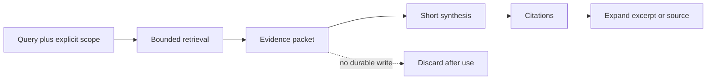
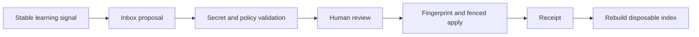

# Source-Grounded Query And Consolidation Design

Status: non-normative research input. This document does not change the V3
task graph, mark a planning gate complete, or claim a shipped summarization
runtime.

Sources checked: 2026-08-18

## Decision

Adopt the source-grounded interaction pattern popularized by NotebookLM,
renamed Gemini Notebook by Google on 2026-07-16, without copying its product,
cloud runtime, or unpublished retrieval implementation.

The useful pattern is:

```text
explicit corpus -> relevant evidence -> short grounded answer -> cited expansion
```

ai DeMemory adds a boundary that a durable memory system cannot omit:

```text
query-time consolidation: read-only, ephemeral, discardable
durable consolidation: proposal -> review -> fenced apply -> receipt -> reindex
```

A generated response is never canonical memory merely because it is concise,
useful, or cited.

## What Google Documents

The following are observable product contracts, not assumptions about private
implementation details:

- A notebook is a project-specific collection of sources. Notebooks are
  independent and do not search across one another at the same time.
- Users can select or exclude sources. In the standard source-grounded chat
  mode, answers use the active source set and expose inline citations that
  resolve to source context. The separate 2026 agentic modes can operate beyond
  an imported source set and are not part of this contract.
- With many sources, the product retrieves relevant information before it
  builds a response. It may decline when the answer is absent from the sources.
- Source-level guides, whole-notebook summaries, reports, briefings, study
  guides, audio, video, and other generated artifacts are derived views over
  the source set.
- Notes may be written by a person or saved from a generated answer, and may be
  converted into sources. That is convenient for research but unsafe as an
  automatic durable-memory rule.
- Generated answers and artifacts can still be inaccurate. Grounding improves
  inspectability; it does not prove correctness.
- The 2026 product adds agentic web research, code execution, a cloud computer,
  and many hosted skills in some tiers. Those features are not prerequisites
  for the source-grounded pattern and are explicitly outside this design.

The official sources reviewed do not disclose NotebookLM/Gemini Notebook's
exact chunking, embedding model, vector store, candidate count, reranker,
prompts, or entailment checks. Describing its internals as a particular RAG
stack would therefore be speculation. ai DeMemory should reproduce the
documented contract and validate its own implementation independently.

Primary sources:

- [Create a notebook](https://support.google.com/gemininotebook/answer/16206563?hl=en)
- [Add or discover sources](https://support.google.com/gemininotebook/answer/16215270?hl=en)
- [Use chat](https://support.google.com/gemininotebook/answer/16179559?hl=en)
- [Learn about Gemini Notebook](https://support.google.com/gemininotebook/answer/16164461?co=GENIE.Platform%3DDesktop&hl=en)
- [Create and add notes](https://support.google.com/gemininotebook/answer/16262519?hl=en)
- [Privacy and terms](https://support.google.com/gemininotebook/answer/17004255?hl=en)
- [NotebookLM is now Gemini Notebook](https://blog.google/innovation-and-ai/products/gemini-notebook/notebooklm-gemini-notebook/)
- [2026 research and agentic update](https://blog.google/innovation-and-ai/products/notebooklm/better-research-notebooklm/)
- [Google Research evaluation of source-grounded research systems](https://research.google/blog/testing-llms-on-superconductivity-research-questions/)

Adjacent grounding research, not Gemini Notebook product documentation:

- [Attribute First, then Generate](https://research.google/pubs/attribute-first-then-generate-locally-attributable-grounded-text-generation/)

The Google Research evaluation published in March 2026 is especially useful as
a historical warning, but it evaluated systems accessed in December 2024 and
is not a benchmark of the 2026 product. In that evaluation, strong evidence,
balance, and completeness did not guarantee succinctness, temporal accuracy,
or recovery of sources phrased differently from the query. Those remain
separate product-quality dimensions for ai DeMemory to measure itself.

## Adopt, Adapt, Avoid

| Pattern | Decision | ai DeMemory translation |
| --- | --- | --- |
| One explicit bounded corpus per query | Adopt | Resolve the vault, project, sensitivity ceiling, and selected source set before retrieval. |
| Retrieve before composing | Adopt | Keep SQLite FTS as the measured baseline, then hydrate bounded canonical excerpts. |
| Navigable local citations | Adopt | Cite memory id, relative path, heading, revision/hash, and exact excerpt. |
| Short and expanded answers | Adopt | Return a compact result first; expose evidence and ranking detail on demand. |
| Multiple artifact formats | Adapt | Render different read-only views from one evidence packet; do not create new truth stores. |
| Saved answer becomes a source | Adapt strictly | Save only as a provenance-rich proposal; durable promotion still requires review. |
| Source copy or synchronization | Adapt | Record revision and staleness; never update canonical memory silently. |
| Agentic web and cloud computer | Avoid as a core dependency | No implicit web, cloud, Node, model, or code-execution requirement. |
| Citation implies correctness | Avoid | Measure whether every claim is actually supported and current. |
| Query mutates durable memory | Avoid | Query and synthesis paths are read-only by contract. |

## Two Separate Loops





The first loop answers a question. The second changes what the system knows.
They must never be collapsed into one automatic operation.

## Query Contract

### 1. Resolve a corpus manifest

Before touching the index, resolve an ephemeral `CorpusManifest` from:

- an explicit vault binding;
- the active project or an explicit cross-project selection;
- included and excluded memory ids or source groups;
- status, lifecycle, trust, and sensitivity policy;
- canonical revisions and index generation;
- candidate, byte, token, and time ceilings.

Ambiguous root, project, or authorization must produce a typed refusal. Chat
history and the current working directory cannot silently widen the corpus.

### 2. Retrieve and hydrate evidence

Use the current SQLite FTS and explainable ranking baseline. Retrieval should:

1. filter policy and project scope before applying the result limit;
2. produce a bounded candidate set;
3. hydrate excerpts from the current Markdown revision, not stale index text;
4. retain conflicting, stale, and superseded state when it affects the answer;
5. record why each selected item ranked and, only for already authorized
   candidates, why it was omitted.

A vector or model-assisted candidate union remains optional and must beat the
same FTS baseline on a held-out corpus before adoption.

### 3. Build an evidence packet

The evidence packet is the query-time consolidation unit. It is generated,
bounded, read-only, and disposable. An illustrative row is:

```json
{
  "citation_id": "M1",
  "memory_id": "mem_example_20260818",
  "path": "memories/projects/example.md",
  "heading": "Decision",
  "content_hash": "...",
  "status": "active",
  "sensitivity": "internal",
  "excerpt": "...",
  "ranking": {"matched_fields": ["title", "body"]},
  "supports": ["claim-1"],
  "contradicts": []
}
```

The user/model `EvidencePacket` contains only authorized, selected evidence,
the ephemeral query needed for the current execution, a policy-applied marker
that does not depend on whether a denied source exists, budget use, conflicts,
and an `insufficient_evidence` reason when applicable. It must not contain a
hidden copy of the whole vault, and it is not persisted as a durable query log.

A separate restricted `RetrievalAudit` may hold ranking diagnostics in memory
for the duration of local verification. It is never supplied to a host model
or ordinary user response, inherits the maximum sensitivity of the query and
all considered candidates, and uses a query digest only as an identifier, not
as anonymization. Policy-denied sources expose no query-dependent count, id,
path, title, excerpt, or source-existence hint. Omission detail is available
only for sources that the caller was already authorized to inspect. Persisting
an audit would create a separate opt-in writer and therefore requires a TTL,
fencing, a receipt, and inclusion in the canonical writer inventory.

### 4. Compose in layers

Layer 0, brief answer:

- one to three sentences by default;
- `supported`, `partial`, `conflicted`, or `insufficient_evidence`;
- scope and source count;
- no unsupported confidence percentage.

Layer 1, essential evidence:

- at most a small bounded set of claims;
- one or more resolvable citations per factual claim;
- relevant date, staleness, supersession, or disagreement;
- an explicit statement of what was not found.

Layer 2, expansion:

- exact excerpts and source context;
- `--why` ranking components;
- the policy ceilings applied, independent of whether any protected source
  existed or was denied;
- budget omissions only for already authorized sources;
- full canonical files only after the same authorization check.

An optional host model may synthesize only from the packet. With model policy
`off`, ai DeMemory still returns a useful deterministic evidence view. The core
runtime makes zero model and embedding calls.

### 5. Reuse existing resource profiles

Do not add a second intensity system. The existing `minimal`, `balanced`, and
`active` profiles in `scripts/resource_policy.py` already define context and
recall ceilings:

- `minimal`: manual, compact evidence retrieval with almost no background work;
- `balanced`: the default bounded per-turn experience;
- `active`: larger but still hard-capped retrieval for an always-on workstation.

The wizard may explain the trade-off, but must show exact planned budgets and
background jobs before apply. A more persuasive answer format must never gain a
larger sensitivity scope.

## Durable Consolidation Contract

If a query reveals a useful stable learning, the only permitted continuation
is a proposal containing:

- a query digest, a redacted purpose summary, and the corpus manifest digest;
- cited evidence rows and their canonical revisions;
- proposed claim, scope, lifecycle, confidence, and sensitivity;
- contradictions, superseded items, and expected information loss;
- author, reviewer requirement, and expiry.

Raw query retention is opt-in only. When justified, it must carry an explicit
sensitivity label and short TTL, and cannot silently inherit the lifetime of
the promoted memory.

Promotion then follows the existing review-first controls: secret scan,
schema validation, exact preview fingerprint, expected revisions, fenced
atomic write, receipt, index rebuild, and a repeated retrieval check. A saved
model response is derived content and must preserve that provenance.

## Evaluation Gate

Split evaluation data by memory lineage and time, not by random paraphrase, so
near-duplicate content cannot leak across train and test sets. Include:

- answerable and intentionally unanswerable queries;
- paraphrases without exact source vocabulary;
- wrong-project and cross-vault canaries;
- private and sensitive memories;
- stale and superseded facts;
- active contradictions and time-dependent answers;
- hostile source text containing prompt-like instructions;
- answers requiring evidence from multiple memories.

Measure retrieval and answer quality separately:

- Recall@k, MRR, and nDCG against the current FTS baseline;
- zero cross-vault, cross-project, and sensitivity leakage;
- citation resolvability against the exact consulted hash;
- claim-to-evidence support precision and citation completeness;
- unsupported-claim and false-answer rates;
- abstention precision and recall;
- contradiction, supersession, and temporal accuracy;
- initial-answer tokens and human usefulness per token;
- p50/p95 latency, bytes read, candidates, peak RSS, and host-agent tokens;
- verification time or clicks;
- false merges, information loss, idempotence, and recovery for durable
  consolidation.

No model, embedding layer, or vector backend is justified unless it improves
the held-out result without regressing leakage, attribution, abstention,
latency, or resource ceilings.

## Planning Mapping

This research does not create task ids, change their status, or assign this
design to an unrelated task. The rows below are prerequisites or future
non-regression checks only:

| Existing id | Prerequisite or non-regression relationship |
| --- | --- |
| `BRG-003` | Its explicit deterministic vault binding must exist before any corpus resolver can be trusted. |
| `BRG-017` | Its strict configuration and diagnostic boundary must cover any future query-policy keys. |
| `BRG-019` | If a query bridge is later implemented, its surface and exact artifacts must enter the generated bridge inventory. |
| `MIG-001` | A later implementation must prove that query-time synthesis adds no canonical writer. |
| `GATE-B` | A later migratable implementation must preserve demonstrated V2 compatibility; this document alone is not gate evidence. |
| `ONB-001` | This is only a future UX consumer, after `GATE-B`, for explaining scope, intensity, model policy, preview, and rollback. |

The normative planning contract always determines the legal frontier. At the
2026-08-18 source check it listed `BRG-003` and `BRG-017`; this research cannot
advance them or authorize query-response implementation.
